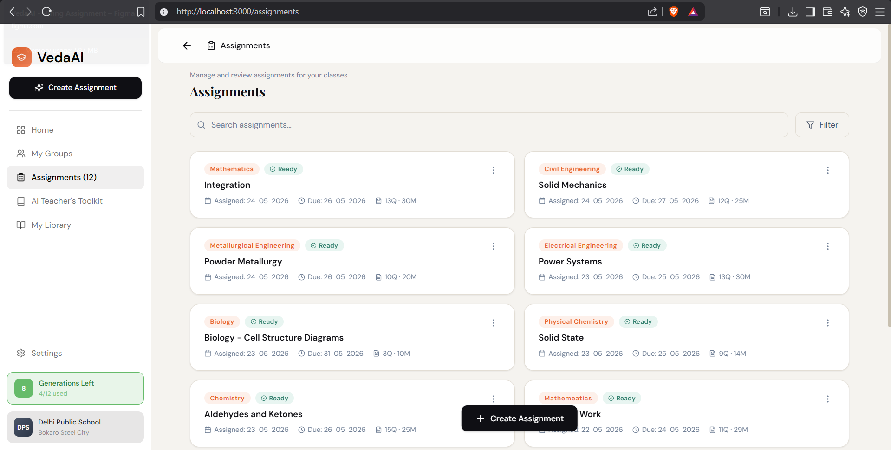
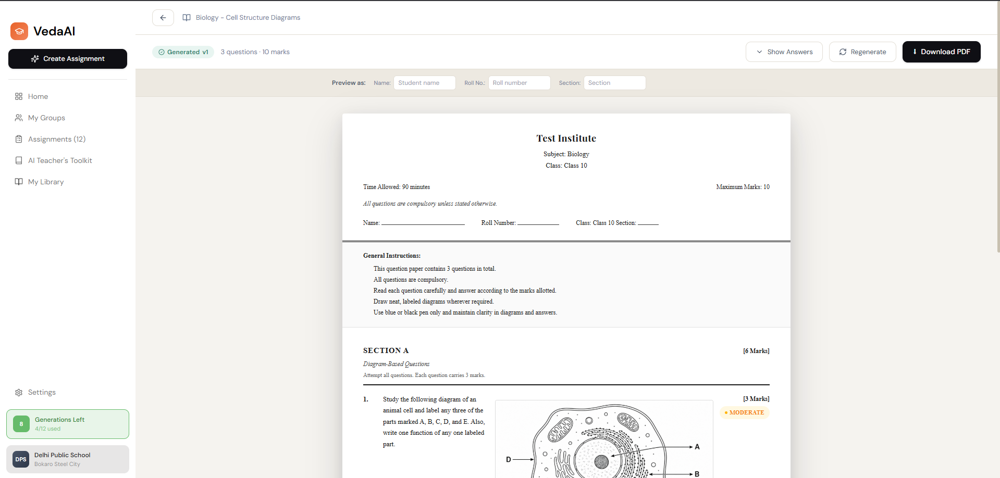

# VedaAI – AI Assessment Creator

> An intelligent exam paper generation system for educators — create curriculum-aligned, beautifully formatted question papers in seconds.





---

## ✨ Features

- **Multi-step assignment creation** — guided form with validation
- **AI-powered generation** — structured prompts → parsed JSON → never raw LLM output
- **Real-time updates** — WebSocket notifies frontend the instant the paper is ready
- **Exam-quality output** — proper CBSE-style formatting with sections, difficulty tags, marks
- **Print / Download PDF** — browser print API with print-specific CSS
- **Regenerate** — one-click to get a fresh paper
- **Answer key toggle** — toggle model answers inline
- **MongoDB persistence** — assignments, generated papers, job records all stored

---

## 🏗 Architecture

```
┌─────────────────────────────────────────────────────────┐
│                     FRONTEND (Next.js)                  │
│  ┌──────────┐  ┌────────────┐  ┌──────────────────────┐ │
│  │ Zustand  │  │ react-hook │  │   WebSocket Client   │ │
│  │  Store   │  │   -form    │  │   (socket.io-client) │ │
│  └──────────┘  └────────────┘  └──────────────────────┘ │
└────────────────────────┬────────────────────────────────┘
                         │ HTTP / WebSocket
┌────────────────────────▼────────────────────────────────┐
│                    BACKEND (Express + TS)               │
│                                                         │
│  POST /api/assignments  →  creates assignment           │
│             OR           fires generation/regeneration  |
| POST /api/papers/regenerate/:Id                         │
│       │                    [enqueue to BullMQ]          │
│       ▼                                                 │
│  generateQuestionPaper()  →  OpenAI API                 │
│       │       |            structured prompt            │
│       │       ▼           JSON response parsing         |
|       |   If Image Gen                                  |
|       │       |                                         |
|       |       --> Upload on Cloudinary                  |
|       |           and Get URL                           |
│       ▼                                                 │
│  MongoDB.save(GeneratedPaper)                           │
│       │                                                 │
│  io.emit("job:progress", ...)  →  WebSocket broadcast   │
│                                                         │
│  [BullMQ Flow]                                          │
│  paperGenerationQueue.add(job)                          │
│       ↓ Redis                                           │
│  paperWorker.process(job)                               │
│       ↓                                                 │
│  emitJobProgress() via WebSocket                        │
└─────────────────────────────────────────────────────────┘
```

---

## 📁 Project Structure

```
vedaai/
├── backend/
│   ├── src/
│   │   ├── models/
│   │   │   ├── Assignment.ts      # Assignment schema + validation
│   │   │   ├── GeneratedPaper.ts  # Full paper with sections/questions
│   │   │   └── JobRecord.ts       # BullMQ job tracking in MongoDB
│   │   │   └── CreationQuota.ts  # Handling the generation requests
│   │   ├── routes/
│   │   │   ├── assignments.ts     # CRUD + trigger generation
│   │   │   └── papers.ts          # Fetch + regenerate papers
│   │   ├── controllers/
│   │   │   └── aiController.ts    # Prompt builder + AI call + parser
│   │   ├── workers/
│   │   │   └── queues.ts          # BullMQ setup (commented, ready to activate)
│   │   └── index.ts               # Express + Socket.IO + MongoDB bootstrap
│   ├── .env.example
│   ├── package.json
│   └── tsconfig.json
│
└── frontend/
    ├── public/fonts     # fonts to handle symbols in PDF
    ├── src/
    │   ├── app/
    │   │   ├── assignments/page.tsx   # Assignments list
    │   │   ├── create/page.tsx        # Multi-step creation form
    │   │   └── output/[id]/page.tsx   # Generated paper viewer
    │   ├── components/
    │   │   ├── output/ExamPaperPDF.tsx # Paper downloading utility
    │   │   └── ui/Sidebar.tsx
    │   ├── store/
    │   │   └── assignmentStore.ts     # Zustand store
    │   ├── lib/
    │   │   ├── api.ts                 # Typed API client
    │   │   └── socket.ts              # WebSocket hook
    │   └── types/index.ts             # Shared TypeScript types
    ├── next.config.js
    ├── tailwind.config.js
    └── package.json
```

---

## 🚀 Setup & Run

### Prerequisites
- Node.js 18+
- MongoDB (local or Atlas)
- Anthropic API key

### Backend

```bash
cd backend
npm install
cp .env.example .env
npm run dev
# → http://localhost:4000
```

### Frontend

```bash
cd frontend
npm install
# Create .env.local:
echo "NEXT_PUBLIC_API_URL=http://localhost:4000" > .env.local
npm run dev
# → http://localhost:3000
```

---

## 🧠 AI Approach

- **Prompt engineering**: structured prompt with section-by-section instructions, difficulty distribution targets (40% Easy / 35% Moderate / 20% Hard / 5% Challenging)
- **Output format**: AI instructed to return strict JSON only — no markdown fences, no preamble
- **Parsing**: response is cleaned of any accidental fencing, then JSON.parsed and validated
- **Image Gen**: Image generation is done for required questions.
- **Cloudniary upload**: Generated image is uploade on cloudinary and accessed via url
- **Never rendered raw**: LLM output is mapped to typed `IGeneratedPaper` schema before any display

---

## 📋 MongoDB Schemas

| Schema | Purpose |
|--------|---------|
| `Assignment` | Core metadata (title, subject, class, question types, status, jobId) |
| `GeneratedPaper` | Full paper (sections → questions with difficulty, marks, answer keys) |
| `JobRecord` | BullMQ job tracking (progress, attempts, error, completedAt) |
| `CreationQuota` | Generation request tracking to avoid API Overuse |

---

## 📄 PDF Export

Key points about PDF generation and export:

- **Where it's rendered:** front-end using `@react-pdf/renderer` (validated `IGeneratedPaper` is the source of truth).
- **Images:** embeds Cloudinary-hosted images (use print-focused transforms / high-DPI variants stored in `GeneratedPaper`).
- **Fonts:** registers Times-family fallback and optional math glyph fonts to ensure symbols render correctly across platforms.
- **Layout:** print-optimized styles, page-break rules, headers/footers, and marks ensure printed output matches previews.
- **Quality:** request lossless or high-quality Cloudinary variants for diagrams (aim for ~300 DPI equivalence).
- **Download & Print:** `DownloadPDFButton` triggers client-side generation and file save; users can also print directly from the preview.
- **Metadata & accessibility:** PDFs include title/author metadata; images reference stored alt/description fields when available.
- **Fallbacks:** missing assets show placeholders; cached Cloudinary variants speed up repeated exports.

---
## **Developer Notes**

- **Cloudinary (image / diagram handling)**: Cloudinary is integrated for image uploads and diagram storage/serving. The Cloudinary helper and upload middleware are located at `backend/src/lib/cloudinary.ts` and `backend/src/middleware/upload.ts` — these are used by any diagram or image-generation flows.

- **PDF font / symbol support**: The PDF generation code (`frontend/src/components/output/ExamPaperPDF.tsx`) has been adjusted to ensure fonts used in PDF output render special symbols correctly (registered fonts / Times-family fallback). If you need extra symbol coverage (e.g., math glyphs, uncommon diacritics), consider adding and registering the specific font file with `@react-pdf/renderer`.

- **MCQ question parser**: An inline MCQ parser utility (`frontend/src/lib/mcqParser.ts`) was created to parse inline option markers like `(A) option 1 (B) option 2`. It was used in the output preview to format MCQ items. Per latest requests, parses were removed from the PDF and the parser utility was deleted from the repo; the output now renders the original `question.text`. If you want the parser reinstated, reintroduce `parseInlineMcq()` and the small parsing utility.

---

*Built with ❤️ for VedaAI Hiring Assignment*


